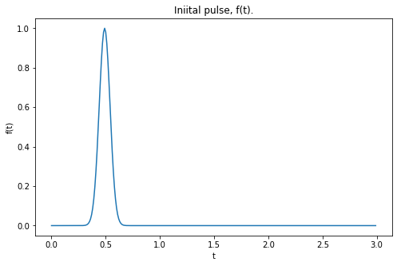
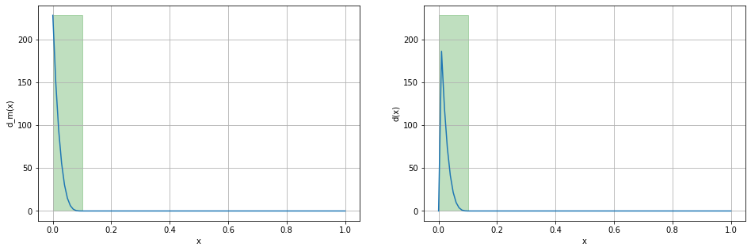

.. role:: m(math)

.. figure::  assets/IP_logo3/IP_logo3.001.png
   :align:   center

===========================
Formulation (deterministic)
===========================

Direct Problem
--------------

The direct problem is a wave equation, written in the form of a system of first-order PDEs. With minor 
modifications, this system is applicable to acoustic, elastic or electromagnetic waves.

For tuning of the direct and inverse problems, it is recommended to begin with the one dimensional case.
The extension to higher dimensions is relatively straightforward.

Staggered grid formulation for 1D Wave Equation
-----------------------------------------------

For tuning of the direct and inverse problems, it is recommended to begin with the one dimensional case.
The extension to higher dimensions is relatively straightforward.

The 1D (acoustic) wave equation in velocity-pressure formulation is a coupled system of two first-order partial differential equations

.. math::
    \rho \frac{\partial v}{\partial t} &= \frac{\partial  p}{\partial x} , \quad x \in [0,L], \quad t >0, \\
    \frac{\partial p}{\partial t}   &= \mu \frac{\partial v}{\partial x}  + f, \quad x \in [0,L], \quad t >0,

where,

- :m:`p` is the pressure,
- :m:`\rho`  is the density,
- :m:`v` is the velocity,
- :m:`\mu = \rho c^2` is the shear modulus, and
- :m:`f` is the source (in the fluid).

The initial condition is set to zero,

.. math::
    v(x,0) = p(x,0) = 0,

since we are using a time-dependent source

.. math::
    f(x,t) = F(t) \delta(x),

where 

.. math::
    \delta(x)=\begin{cases}
         1, & x=x_{s},\\
         0, & \mathrm{elsewhere},
     \end{cases}

and :m:`F(t)` is either a Gaussian or some type of Ricker wavelet.

For grid staggering, the discrete velocity and pressure are defined on a regularly 
spaced grid in space and time. Then, partial derivatives are replaced with centered 
finite-difference approximations of the first derivatives. 
However, these are not defined at the grid points  but midway between them.
In 2nd-order grid staggering the following computational scheme is used

.. math::
    \frac{v_i^{j+ \tfrac{1}{2}} - v_i^{j- \tfrac{1}{2}} }{\Delta t}  &=  \frac{1}{\rho_i}\frac{p_{i + \tfrac{1}{2}}^j - p_{i - \tfrac{1}{2}}^j }{h} \\
    \frac{p_{i+\tfrac{1}{2}}^{j+1} - p_{i+\tfrac{1}{2}}^j }{\Delta t}  &=  \mu_{i+\tfrac{1}{2}}  \frac{v_{i + 1}^{j +\tfrac{1}{2}} - v_i^{j + \tfrac{1}{2}} }{h} + f_{i+\tfrac{1}{2}}^j

The explicit scheme becomes

.. math::
    v_i^{j+ \tfrac{1}{2}} &= v_i^{j- \tfrac{1}{2}}  + \frac{\Delta t}{h} \frac{1}{\rho_i}  \left(p_{i + \tfrac{1}{2}}^j - p_{i - \tfrac{1}{2}}^j \right) \\ 
    p_{i+\tfrac{1}{2}}^{j+1} &=  p_{i+\tfrac{1}{2}}^j  + \frac{\Delta t}{h} \ \mu_{i+\tfrac{1}{2}} \left( v_{i + 1}^{j +\tfrac{1}{2}} - v_i^{j + \tfrac{1}{2}} \right)  + \Delta t \  f_{i+\tfrac{1}{2}}^j

**Note that in the code we do not deal with the index fractions.** We use the convention

.. math::
     v^{j - \tfrac{1}{2}} \rightarrow v [n-1], \\
     v^{j+ \tfrac{1}{2}} \rightarrow v [n],

and

.. math::
     p_{i - \tfrac{1}{2}} \rightarrow p [i-1], \\
     p_{i+ \tfrac{1}{2}} \rightarrow p [i].

General Formulation
-------------------

We can formulate a more general, 2nd-4th order scheme as follows.

.. math::
    v_i^{j+ \tfrac{1}{2}} &= v_i^{j- \tfrac{1}{2}}  +  
    \frac{1}{\rho_i} \frac{\Delta t}{h} \left[ a \left( p_{i + \tfrac{3}{2}}^j 
    - p_{i - \tfrac{3}{2}}^j \right) 
    + b \left( p_{i + \tfrac{1}{2}}^j - p_{i - \tfrac{1}{2}}^j \right) \right]
    \\
    p_{i+\tfrac{1}{2}}^{j+1}  &=  p_{i+\tfrac{1}{2}}^j  + 
    \mu_{i+\tfrac{1}{2}} \frac{\Delta t}{h} \ \left[ a  \left( v_{i + 2}^{j +\tfrac{1}{2}} 
    - v_{i-1}^{j + \tfrac{1}{2}} \right) 
    + b \left(v_{i + 1}^{j +\tfrac{1}{2}} - v_i^{j 
    + \tfrac{1}{2}} \right) + \Delta t \  f_{i+\tfrac{1}{2}}^j
    \right]

where 

- for 4th order in space: :m:`a = -1/24,` `b = 9/8`
- for 2nd order in space:  :m:`a = 0,` `b = 1.`

The 4th order scheme is particularly useful/indicated for discontinuous media, 
where it can provide a less oscillatory solution. (**TBC**)

Boundary conditions
-------------------

We will use a CPML absorbing boundary condition at the left-hand extremity, :m:`x=0,` as formulated below, 
and a mixed boundary condition at the right-hand extremity, :m:`x=L.`

The mixed condition is written as

.. math::
     \frac{\partial u}{\partial n} + \alpha u = \beta,

where :m:`u = v` or :m:`u=p,` the normal derivative is just :m:`d/dx` in 1D and when :m:`\alpha=0` 
we obtain a pure Neumann condition.

We will use a second-order accurate approximation of :m:`du/dx` at :m:`x=x_M=L,`

.. math::
     \frac{du}{dx} \approx \frac{3u_M - 4u_{M-1} + u_{M-2}}{2h},

the right-hand extremity.  The approximate mixed condition then gives an equation for the unknown value

.. math::
    u_M = \frac{1}{3+2h\alpha}(2h\beta + 4u_{M-1} - u_{M-2}  ).

For the fourth-order scheme, we will use the same scheme, since derivative boundary conditions 
can become quite "unwieldy" in this case---see Strikwerda, 2005.

An alternative, is to use a centrered difference,

.. math::
     \frac{du}{dx} \approx \frac{u_{M+1} - u_{M-1}}{2h} 

and the stencil for the wave equation at :m:`x=x_M,` to eliminate the "ghost" value :m:`u_{M+1} .`

CPML Condition
--------------

**Memory variables**

The CPML is based on the stretched coordinate, 

.. math::
     s_c = \kappa_x + \frac{d_x}{\alpha_x + \mathrm{i} \omega},

where :m:`d_x` is the damping function defined below, :m:`\kappa_x`  and :m:`\alpha_x` 
are positive constants, and :m:`\omega` is the frequency. 
The classical PML is a special case, obtained for :m:`\kappa_x  = 1` 
and :m:`\alpha_x = 0.` Transforming back to the time domain, 
we obtain the change of variables for the :m:`x`-derivative,

.. math::
    \partial_{x} \rightarrow \partial_\tilde{x} = \frac{1}{\kappa_x} \partial_x + \psi_x,

where the *memory variable,* :m:`\psi_x,` is computed by the time-update

.. math::
  \psi_x^n = b_x \psi_x^{n-1} + a_x (\partial_x)^{n+1/2} 

with the coefficients

.. math:: 
    a_x = \frac{d_x}{\kappa_x(d_x + \kappa_x \alpha_x)} (b_x - 1)

and

.. math::
    b_x = \mathrm{e}^{-\left({d_x}/{\kappa_x} + \alpha_x \right)\Delta t}.

For the stretched coordinate coefficients, we will fix :m:`\kappa_x = 1` 
since it has very little effect on elastic wave propagation (evanescent waves) 
and  :m:`\alpha_x` varies linearly in the layer from :m:`\alpha_\mathrm{max}` at 
:m:`x=x_L` and :m:`x=x_R` to zero at the outer edges of the layers, :m:`x=x_L -l` 
and :m:`x=x_R + l,` respectively. 

Finally, we set :m:`\alpha_\mathrm{max} = \pi f_0,`  where :m:`f_0` is the 
dominant frequency of the source. 

**Damping function**

Set up the 1D damping function, :m:`d_x(x),` in the PML regions, 
i.e. at one or both extremities of the 1D interval in this case.

.. math::
    d_x(x) = \begin{cases}
        d_0 \left( \dfrac{x}{\ell}  \right)^m, & x \in \Omega_{\mathrm{pml}}\\
        0, & x\in \Omega \setminus \Omega_{\mathrm{pml}}
    \end{cases}   

where 

.. math:: 
     d_0 = \frac{(m+1)c_p \log (1/R_c)}{2\ell}

and

- :m:`m` is the polynomial decay order, usually 2, 3 or 4
- :m:`\ell` is the width of the PML layer
- :m:`c_p` is the compressional wave speed
- :m:`R_c` is the desired reflection coefficient at normal incidence, usually :m:`10^{-4}` to :m:`10^{-6}`

Inverse Problem
---------------
.. admonition:: Inverse Problem

    The inverse problem is formulated as follows: given :m:`\rho,\ f` and measurements of :m:`v(x,t),\ p(x,t)` for :m:`x=l` (the entrannce to the PML) 
    and :m:`t>0,` compute the unknown :m:`\mu(x).`

- adjoint and gradient
- optimization
- regularization 
   + classical (L1-L2, TV, gradient, etc.)
   + by neural networks

========================
Formulation (stochastic)
========================

Statistical regularization, and Bayesian inversion in particular, provides a complete methodology of
statistical inference for inverse problems. We can treat both data and model parameters as realizations 
of random variables and then express the inverse problem as a problem of statistical inference. Bayesian 
statistics provides a natural setting for this.

Stochastic differential equations can provide the most general and complete description of a true 
problem of wave propagation in a random medium. This SDE, or system of SDEs, can then be the
the basis for solving the direct problem. In addition, different approaches are available
for solving the parameter identification inverse problem, such as

- fixed point 
- Euler-Maruyama to give a Markov chain
- MCMC

.. admonition:: Definition
    
    A *statistical inverse problem* is the task of recovering the (posterior) conditional distribution 
    :m:`\pi` of the model parameters :m:`f`  under the joint law :m:`\mu` from measured data :m:`y.`

Bayesian Inversion Approach
---------------------------

TBC.

Stochastic Differential Equation Approach
-----------------------------------------

TBC.

More details and implementation coming soon...
