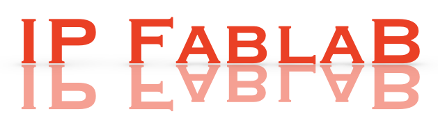

============
Introduction
============

IP FablaB is a generic platform for formulating, analyzing and solving inverse problems of *imaging* type.
It attempts to fill the gap between theory and practise, by providing all the tools needed
for contructing simulators for both direct and inverse problems:

- choice of physical problem type (acoustic, elastic, electromagnetic)
- choice of realistic boundary conditions (Dirichlet, Neumann, Mixed, PML)
- choice of probing pulse (form, location, frequency)
- choice of measurement/observation points (number, locations)
- choice of inversion strategy (classical optimization, neural network based)

Full details of the direct and inverse problem formulations can be found in the **Formulation** section
of this documentation.

Implementation
--------------

All code is in Python, with the option of full Pytorch functionality to enable efficient computation 
on GPUs.

References
----------

[`Asch2022 <https://my.siam.org/Store/Product/viewproduct/?ProductId=41813926>`_] M. Asch. *A Toolbox for Digital Twins: from Model-Based to Data-Driven.* SIAM. 2022 
